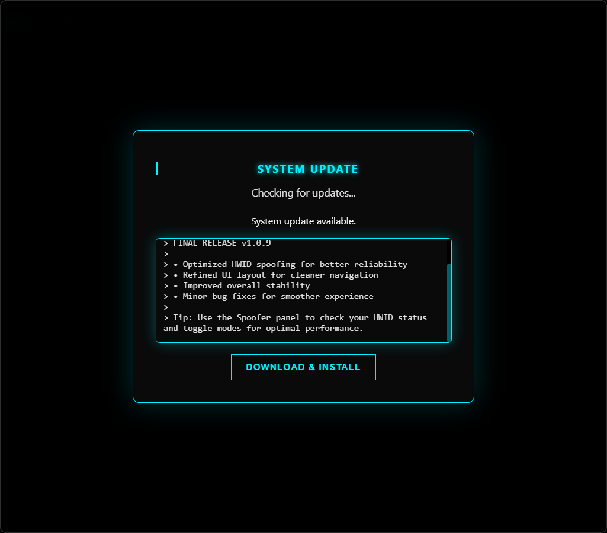

# SOLOKNIGHT AIO Loader

**Version:** 1.0.5-Beta  
**Author:** SRC DEV

---

## 🚀 Overview

SOLOKNIGHT is a modular **game loader and mod menu** for supported titles, including:

- **CS2**  
- **COD**  
- **Fortnite**  
- **GTA V Story Mode**  

Built with **C# WinForms** for the frontend and a **C++ DLL** for injection and low-level system interactions, SOLOKNIGHT combines sleek design, powerful features, and hardware-level spoofing for security and privacy.

---

## 🎨 Features

### User Interface
- Modern **multi-tab layout**: Home, Games, Spoofer, HWID, Settings
- Dynamic **news feed** with typewriter effect
- **Animated game cards** with rotating images every 3 seconds
- Interactive **terminal interface** for commands and logs
- Clean, responsive **WinForms + ImGui overlay**

#### Example UI:


---

### Game Support
- CS2 DLL & External injection
- COD & Fortnite injection modules
- Auto-launch & auto-close options for convenience

#### Game Cards Animation:


---

### Security & Spoofing
- **Permanent HWID spoofing** via motherboard/serial modification
- **Temporary trace cleaner** for session-based spoofing
- **Stream proof mode** hides visuals for safe streaming
- Integrated **terminal logs** for spoofing and hardware status

#### Spoofer Example:


---

### Account & Authentication
- **License key authentication** with server verification
- Profile picture sync via backend API
- HWID reset requests
- Discord Rich Presence support

---

### Updater
- Automatic **update notifications**
- **Download progress bar** for updates
- Integrated news feed during updates

#### Updater Overlay:


---

## 🛠 Installation

1. Clone or download the repository:
```bash
git clone https://github.com/yourusername/soloknight-loader.git